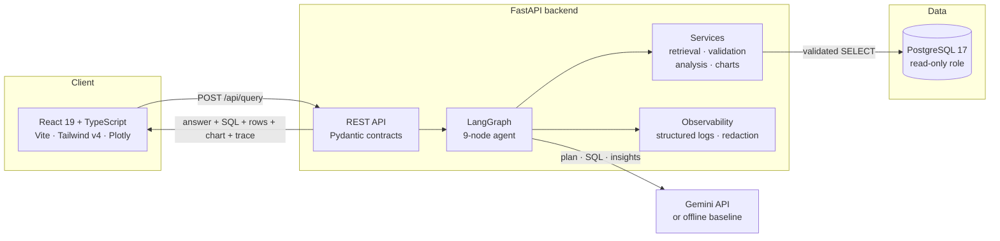
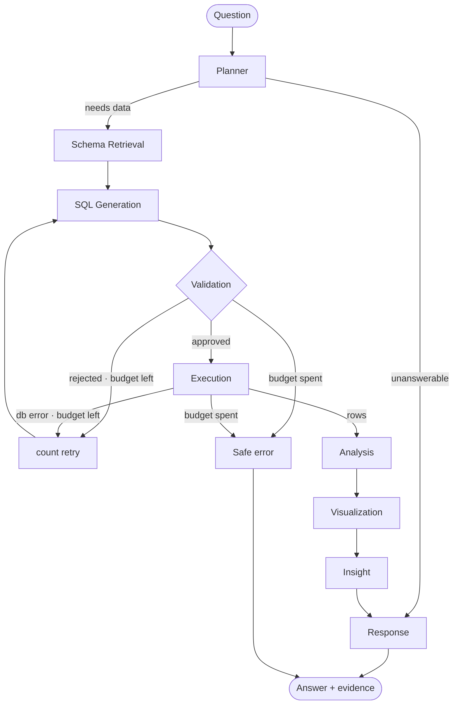

<div align="center">

# DataPilot AI

**An agentic AI data analyst that turns natural-language questions into validated SQL, automated analysis, visualizations, and business insights.**


</div>

---

## 1. What this is

Ask a business question in English. DataPilot AI plans the analysis, retrieves
only the relevant schema, writes PostgreSQL, **validates it before it runs**,
executes it under a read-only role with a timeout and a row cap, analyses the
result with Pandas, picks a chart, and explains what the numbers show.

Every answer ships with its evidence: the SQL, the rows, the chart, the
execution trace, and every SQL attempt that was rejected along the way.

## 2. Why it exists

Business questions are asked in English. Answers live in SQL. Naive
LLM-to-SQL tools do not close that gap, because they fail in ways worse than
being slow:

- They **hallucinate columns and tables** that do not exist.
- They **invent statistics** that are not in the result set.
- They are **unsafe by default** — nothing structurally prevents a generated
  `DELETE`, or a query that runs for twenty minutes.
- They are **unmeasured**. "It looked right in the demo" is the whole quality bar.

A wrong answer delivered confidently in two seconds is worse than no answer.
This project treats the language model as **one component inside a verified
pipeline**, not as the pipeline.

## 3. Architecture



Dependencies point strictly downward: `api` → `agents` → `services` → `database`
→ `core`. Full detail in **[docs/ARCHITECTURE.md](docs/ARCHITECTURE.md)**.

## 4. Agent workflow



Nine nodes; **five are fully deterministic** (schema retrieval, validation,
execution, analysis, visualization). That is what makes the system measurable.

**Error recovery is real.** Both failure edges route back to generation carrying
the reason — the validator's rejection message, or the database's own error text
— so a retry is informed rather than a blind re-roll. Three independent bounds
prevent a loop: `SQL_MAX_RETRIES`, `AGENT_MAX_STEPS`, and LangGraph's recursion
limit.

## 5. Security

The central claim: **the agent cannot write to the database, and this is
enforced in two independent places.**

| Control | Mechanism |
|---|---|
| SQL validation | `sqlglot` parses to an AST. Rejects non-SELECT node types anywhere in the tree, multiple statements, `SELECT INTO`, locking clauses, filesystem/admin functions, and system catalogs. |
| Table allow-list | Every referenced table must be in the *retrieved* schema — catches hallucinated relations before the database does. |
| Database role | `datapilot_readonly` holds `CONNECT`, `USAGE`, `SELECT`. No `INSERT`/`UPDATE`/`DELETE`/`TRUNCATE`/`CREATE`, no sequence `USAGE`, not a superuser. |
| Runaway queries | Server-side `statement_timeout` + hard row cap applied while streaming. |
| Secrets | `SecretStr` throughout; `.env` git-ignored; redaction in the logging pipeline covers third-party loggers too. |
| Error disclosure | Typed errors carry a technical `detail` (logged) and a `safe_message` (returned). Driver text never reaches a client. |
| CORS | Explicit origin allow-list, never a wildcard. |

**Why AST parsing, not regex** — each of these is handled correctly and would be
wrong under pattern matching:

```sql
SELECT * FROM orders WHERE note = 'DROP TABLE customers'  -- accepted (a literal)
SELECT 1;/* comment */DELETE FROM orders                  -- rejected (2 statements)
WITH x AS (DELETE FROM orders RETURNING *) SELECT * FROM x -- rejected (write in CTE)
```

All three are in the test suite, alongside 10 prompt-injection payloads.

## 6. Tech stack

| Area | Choice | Why |
|---|---|---|
| API | FastAPI + Pydantic v2 | Typed contracts, OpenAPI for free |
| Orchestration | LangGraph | Explicit state machine with conditional retry edges |
| LLM | Gemini via `google-genai` | Native JSON mode for structured output |
| SQL safety | `sqlglot` | Real AST parsing beats regex for a security control |
| Database | PostgreSQL 17 + SQLAlchemy 2 + psycopg 3 | Window functions, role-level read-only |
| Analysis | pandas + numpy | Statistics **computed**, never generated |
| Frontend | React 19, TypeScript (strict), Vite 6, Tailwind v4 | |
| Charts | Plotly, dynamically imported | Interactive; kept out of the initial bundle |
| Quality | pytest, ruff, mypy, ESLint | All enforced in CI |

**Python 3.12** is pinned deliberately — 3.13/3.14 wheel coverage across this
dependency chain is not yet dependable.

## 7. Running without an API key

The application runs end to end with **no `GEMINI_API_KEY`**, using a
deterministic rule-based baseline that parses the question and composes SQL from
grammar rules against the same retrieved schema.

This is not a fake. It contains no question-to-answer mapping and no canned
results; questions its rules do not cover are **declined**, not guessed. It
exists so that:

1. the whole suite runs hermetically — no network, no key, no cost;
2. the evaluation has an honest **floor** to measure the model against;
3. a missing key degrades the system honestly instead of breaking it.

Every response it produces is flagged `llm_simulated: true`, and the UI says so
in plain words. It is never presented as model output.

## 8. Evaluation

```bash
cd backend
python -m evaluation.run                 # all cases
python -m evaluation.run --no-retries    # first-attempt quality
python -m evaluation.run --json report.json
```

**44 benchmark cases** across 15 categories, graded mechanically — never by
another model. Each declares expected *characteristics* (tables, columns, row
counts, ordering, value ranges), not an expected SQL string, because there are
many correct ways to write the same query.

A groundedness check acts as a hallucination detector: every figure cited in the
insight text must appear in the returned rows.

### Results

**Offline baseline** — the full benchmark, no API key, no network:

```
cases        44        pass rate      100.0%
passed       44        groundedness   100.0% (35 checked)
failed        0        latency p50     76 ms  ·  p95  152 ms
```

**Live Gemini** (`gemini-3.6-flash`) — partial, see the quota note below:

```
security     6/6 passed   ·  produced SQL 0/6  ·  p50 5.6 s
products     1/1 passed   ·  groundedness 100% ·  22.7 s
```

`produced SQL 0/6` on the security category is the interesting number: the model
declined to write SQL at all for every hostile input, so the validator never
had to fire. Both layers held, and the first one was not even needed.

> **The full 44-case benchmark cannot run on the Gemini free tier.** The limit is
> **20 requests per day, per model**; a full run needs roughly 132. The figures
> above are what the quota allowed. The evaluation runner detects quota
> exhaustion and **aborts with a partial-run notice rather than reporting the
> unreached cases as failures** — a 0% score for cases that were never sent to
> the model would be a fabricated metric.

### What live evaluation actually caught

Running against the real model surfaced a genuine arithmetic error that the
offline baseline could not have: asked for the top ten products, Gemini reported
a total of `18,732,119.61` when the true sum was `18,747,284.48` — wrong by about
15,000, and entirely plausible-looking. The groundedness check flagged it.

Two fixes followed. The insight prompt now instructs the model to take totals
from the **computed analysis block** rather than re-adding a column by hand, and
the grader learned to distinguish a *derived* figure (a partial sum, a share of
a total) from an invented one, so it stays quiet on correct answers and loud on
wrong ones.

Categories include security (6 cases) and unanswerable questions (3), which the
system must refuse rather than answer.

## 9. Local setup

**Prerequisites:** Python 3.12, Node 20+, PostgreSQL 17.

```bash
git clone https://github.com/USERNAME/datapilot-ai.git
cd datapilot-ai
cp .env.example .env          # fill in database passwords; Gemini key optional
```

**Backend**

```bash
cd backend
python -m venv .venv
source .venv/bin/activate                  # Windows: .venv\Scripts\Activate.ps1
pip install -e ".[dev]"
python -m scripts.seed_database            # creates roles, schema, and data
uvicorn app.main:app --reload              # http://localhost:8000/docs
```

**Frontend**

```bash
cd frontend
npm install
npm run dev                                # http://localhost:5173
```

No Docker, no admin rights, and no `psql` required — see
**[docs/LOCAL_POSTGRES.md](docs/LOCAL_POSTGRES.md)** for running a portable
PostgreSQL cluster on Windows.

## 10. Docker

```bash
cp .env.example .env    # passwords are required; compose refuses to start without them
docker compose up --build
docker compose exec backend python -m scripts.seed_database
```

Open <http://localhost:5173>. nginx serves the SPA and proxies `/api` to the
backend, so the browser sees one origin.

> Docker was **not** available on the machine this was built on (no
> virtualization). The Dockerfiles and compose file are written to production
> standards — multi-stage builds, non-root user, healthchecks, pinned base
> images — and are validated by CI, but have not been run locally. That is
> stated rather than glossed over.

## 11. Environment variables

Every variable is parsed and validated by `app/core/config.py`; invalid
configuration fails at startup, not at the first request. See
[.env.example](.env.example) for the full list with comments.

| Variable | Purpose |
|---|---|
| `GEMINI_API_KEY` | Optional. Absent → offline baseline. |
| `POSTGRES_READONLY_*` | The role all agent SQL runs as. |
| `POSTGRES_ADMIN_*` | Migrations and seeding only. |
| `POSTGRES_SUPERUSER_*` | Used once, by bootstrap, to create the roles. |
| `SQL_STATEMENT_TIMEOUT_MS` | Server-side query cancellation (default 10000). |
| `SQL_MAX_RESULT_ROWS` | Hard row cap (default 5000). |
| `SQL_MAX_RETRIES` | SQL repair budget (default 2). |
| `CORS_ALLOWED_ORIGINS` | Comma-separated exact origins. |

## 12. Testing

```bash
cd backend
pytest                       # 470 tests
pytest -m unit               # no database required
pytest -m integration        # requires a seeded warehouse
ruff check . && ruff format --check . && mypy app scripts evaluation

cd ../frontend
npm run lint && npm run typecheck && npm run build
```

Integration tests skip cleanly when no database is reachable — but only for
*absence* of a database, never for a failure.

## 13. Project structure

```
datapilot-ai/
├── backend/
│   ├── app/
│   │   ├── api/routes/       # HTTP boundary — no business logic
│   │   ├── agents/           # LangGraph: state, nodes, graph, runner
│   │   ├── services/
│   │   │   ├── schema/       # catalogue, introspection, retrieval
│   │   │   ├── llm/          # provider interface, Gemini, offline baseline
│   │   │   ├── sql/          # AST validator
│   │   │   ├── analysis.py   # Pandas — computed, never generated
│   │   │   └── visualization.py
│   │   ├── database/         # engine, session, guarded executor, seed/
│   │   ├── models/           # SQLAlchemy warehouse schema
│   │   ├── observability/    # structured logging, redaction, correlation
│   │   └── core/             # settings, typed exceptions
│   ├── evaluation/           # 44-case benchmark + grader
│   ├── scripts/              # seed_database
│   └── tests/{unit,integration}/
├── frontend/src/
│   ├── components/           # ResultPanel, ChartView, Sidebar, composer
│   ├── lib/                  # API client, formatting
│   └── types/                # wire contracts
├── docs/                     # ARCHITECTURE · DATABASE · LOCAL_POSTGRES
└── .github/workflows/ci.yml
```

## 14. Known limitations

Stated plainly, because a portfolio project that overstates itself is worse than
one that is honest about its edges.

- **Docker is unvalidated locally.** See §10.
- **The live Gemini path is verified but not fully benchmarked.** End-to-end
  queries, structured output, security cases and the hardest correctness case
  all pass against `gemini-3.6-flash` / `gemini-3.8-flash`. The full 44-case
  benchmark needs ~132 requests against a **20-per-day free-tier limit**, so the
  complete live number is not yet measured. Every reported figure says which
  provider produced it.
- **Model latency is 5-25 s per question** against the live model, versus ~80 ms
  for the offline baseline. Three sequential model calls (plan, SQL, insight)
  dominate. Streaming, or merging the plan and SQL steps, would help.
- **Conversation history is in-process.** Bounded and LRU-evicted, but it does
  not survive a restart and does not work across replicas.
- **Schema retrieval is lexical, not semantic.** Deterministic and fast, and
  correct for seven tables; a forty-table warehouse would want embeddings. The
  `retrieve()` interface is what would be swapped.
- **No authentication.** Single-user by design. Multi-tenancy would need auth
  plus row-level security.
- **The data window is pinned** to 2024-09-01 → 2026-08-31 so evaluation
  expectations stay stable. Relative dates resolve against that window.

## 15. Future improvements

- Streaming node-by-node progress over SSE, replacing the timed progress
  indicator with real events.
- A semantic layer so "revenue" resolves identically across every question.
- Result caching keyed by normalized SQL.
- Query-plan cost estimation before execution, with confirmation above a
  threshold.

---

<div align="center">
<sub>MIT licensed. Built to demonstrate agentic LLM systems, SQL safety, and evaluation-driven development.</sub>
</div>
