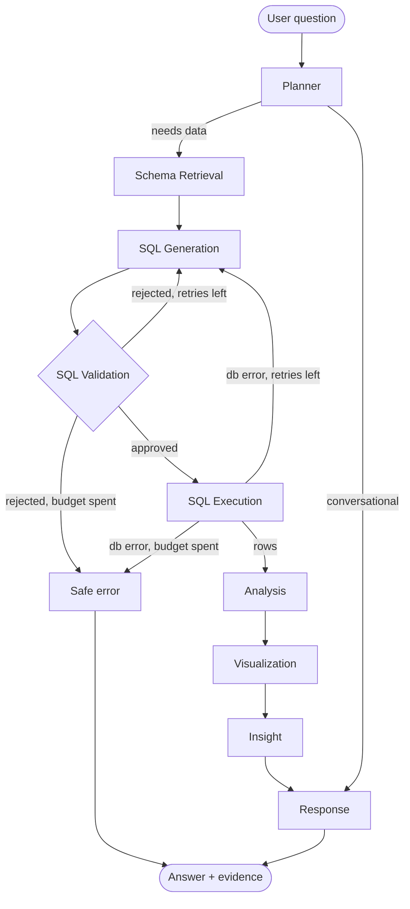

# DataPilot AI — Architecture

Status: **implemented**. This describes the system as built.

---

## 1. Design principles

1. **The LLM proposes; the system verifies.** Generated SQL is parsed into an AST
   and checked before it ever reaches the database. The read-only database role
   is the second line of defence, not the first.
2. **Ground every claim in returned data.** The insight node sees only the actual
   result rows. If the data does not support a conclusion, it must say so.
3. **Retrieve, don't dump.** Only schema relevant to the question is sent to the
   model. A 40-table warehouse must not become a 40-table prompt.
4. **Bounded everything.** Step ceilings, retry ceilings, statement timeouts and
   row caps. No unbounded loop can exist in the graph.
5. **Testable without the network.** Nodes receive their clients; services are
   pure. The full unit suite runs with no database and no API key.

---

## 2. System shape

```
React SPA (Vite)  ──HTTP/JSON──▶  FastAPI  ──▶  LangGraph agent  ──▶  PostgreSQL
                                                      │                (read-only role)
                                                      └──▶  Gemini API
```

Three processes, one network hop each. No queue, no cache tier, no vector
database — none of them are load-bearing at this scale, and each would be
complexity without a justification.

---

## 3. Backend layering

Dependencies point strictly downward. `core` imports nothing from the layers
above it.

| Layer | Package | Responsibility |
|---|---|---|
| HTTP | `app/api` | Routing, validation, error translation. No business logic. |
| Orchestration | `app/agents` | LangGraph nodes, state, edges, retry routing. |
| Capability | `app/services` | LLM client, schema retrieval, SQL validation, analysis, visualization. LangGraph-agnostic and independently testable. |
| Data | `app/database` | Engine/session management, the guarded query executor. |
| Contracts | `app/schemas`, `app/models` | Pydantic wire format; SQLAlchemy warehouse schema. |
| Foundation | `app/core`, `app/observability` | Settings, exceptions, structured logging. |

**Why services are separate from nodes.** A LangGraph node is an orchestration
concern: read state, call something, write state. Putting SQL validation logic
inside a node would make it untestable except through the graph. `services/`
holds the logic; `agents/nodes/` holds the wiring.

---

## 4. Agent graph



Both failure edges — validator rejection and database error — route back to
generation with the failure reason attached, bounded by `SQL_MAX_RETRIES`. A
spent budget terminates in a safe error, never a loop.

### Node contracts

| Node | Reads | Writes | LLM? |
|---|---|---|---|
| Planner | question, conversation context | intent, required analysis, needs_sql/analysis/chart | yes |
| Schema Retrieval | intent, entity mentions | relevant tables + columns + sample values | no |
| SQL Generation | intent, schema subset, prior failure | candidate SQL | yes |
| SQL Validation | candidate SQL | verdict, rejection reason | no |
| SQL Execution | validated SQL | rows, columns, row_count, duration, status | no |
| Analysis | result frame | statistics, trends, anomalies | no |
| Visualization | result frame, intent | chart spec or `none` | partly |
| Insight | result frame, analysis | grounded findings | yes |
| Response | everything | final answer + evidence bundle | yes |

Five of nine nodes are deterministic. That is intentional: it is what makes the
system measurable and the evaluation meaningful.

---

## 4b. Diagnostic investigations

"Why did revenue fall in August?" is not a query. It is a small argument:
establish the change, break it down, check the mechanisms, confirm the parts
add up. The agent answers it on a separate path.

```
planner ─(diagnostic)─▶ investigation ─▶ insight ─▶ response
        └─(otherwise)──▶ schema ─▶ generate ─▶ ... ─▶ response
```

### Who decides what

The brief assigns the model "decide what analytical investigation to perform
next" and assigns deterministic code "metric calculations when definitions are
known". Those pull against each other here. The split is:

| | Decides | Owns |
|---|---|---|
| Model | that this is a diagnostic; the metric; the periods; which dimensions to examine | no figures, no SQL |
| `services/investigation.py` | nothing about intent | every query and every number |

The model's output is four validated fields on `PlannerDecision`, not SQL. A
plan naming a metric or dimension that does not exist is **rejected**, and the
run falls back to the ordinary single-query path rather than approximating it.

The cost is real: the investigation can only follow shapes that exist in the
module. A genuinely novel decomposition is not available. The gain is that
every figure in the evidence trail came from tested code rather than from a
model that was fluent.

### Why the templates are not one generic query

Two subtleties the templates encode, both of which produce plausible wrong
numbers if missed:

- **Grain.** Splitting revenue by category must descend to `order_items`, and
  summing `orders.total_amount` there multiplies each order by its line count.
  The templates switch to `SUM(oi.line_total)` for line-grain dimensions.
- **Reconciliation basis.** Line-level revenue is a *different quantity* from
  order-level revenue — it excludes tax and shipping and carries no
  order-level discount. A category breakdown is therefore reconciled against a
  line-level total, never the headline. Comparing them would report that
  arithmetic as a defect, and the answer carries a caveat saying so.

An `orders` count split by category is not reconcilable at all — an order
spanning two categories is counted in both — so it is excluded from the check
rather than failed.

### What the answer carries

Every step's SQL, the contribution of each dimension value as a signed share
of the change (a group moving against the headline gets a negative share), and
whether the breakdowns reconcile. The narration is assembled from those
numbers in code: a model asked to phrase them could restate one wrongly, and
the sentences a diagnosis needs are formulaic enough not to need one.

## 5. SQL safety model

Four independent layers, each sufficient to stop a write on its own:

1. **AST parse** (`sqlglot`). The statement must parse as exactly one
   `SELECT` (CTEs allowed). Multiple statements, or any DML/DDL node type, is a
   rejection. This is parsing, not regex — `; DROP TABLE` inside a string
   literal is not a false positive, and `/*c*/DELETE` is not a false negative.
2. **Identifier allow-list.** Every referenced table and column must exist in
   the retrieved schema. Catches hallucinated relations before the database does.
3. **Enforced limits.** A `LIMIT` is injected or capped at `SQL_MAX_RESULT_ROWS`.
4. **Read-only role.** The connection runs as `datapilot_readonly`, which holds
   `SELECT` and nothing else, under a `statement_timeout`.

---

## 6. Conversation memory

Full history is **not** replayed to the model. Each turn stores a compact record
— question, resolved intent, tables used, executed SQL, row count. A follow-up
("only the last 6 months") is resolved by the planner against the *previous
turn's structured record*, producing a new standalone intent. This keeps the
prompt bounded and makes follow-up resolution independently testable.

---

## 7. Evaluation

`python -m evaluation.run`, executed from `backend/`. 44 cases, each declaring
expected intent, tables, columns and result characteristics. Measures SQL
validity, execution success, result correctness, groundedness (are cited numbers
present in the returned rows?), hallucination rate, latency, and retry rate.

Evaluation runs with `SQL_MAX_RETRIES=0` for a first-attempt quality signal, and
again with retries on to measure repair effectiveness.

---

## 8. Deviations from the initially sketched tree

- `evaluation/` sits at `backend/evaluation/`, not the repo root, so that the
  specified `python -m evaluation.run` works without path manipulation.
- `tests/` likewise sits at `backend/tests/` — it tests the backend package.
- `observability/` is inside `app/` because it is imported by application code.
- No `react-plotly.js`: a thin locally-owned wrapper around `plotly.js-dist-min`
  avoids a lightly-maintained dependency in the render path.
