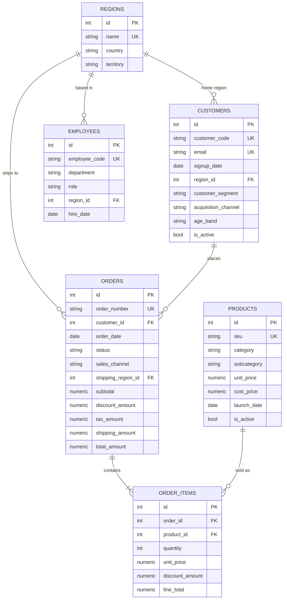

# DataPilot AI — Database

The analytics warehouse the agent queries. PostgreSQL 17.11, seven tables, ~350k
rows, two years of synthetic history generated deterministically from a seed.

---

## 1. Entity relationships



`employees` is deliberately **not** linked to orders. A sales-rep foreign key
would imply every order has an owning rep, which is false for self-serve web
orders and would distort attribution analysis. The table supports headcount and
organisational questions only.

---

## 2. Schema source of truth

Tables are defined once, as SQLAlchemy models, and created from that metadata:

| Module | Contents |
|---|---|
| `app/models/base.py` | Declarative base, constraint naming convention, money types |
| `app/models/enums.py` | Controlled vocabularies (segments, statuses, channels) |
| `app/models/dimensions.py` | `regions`, `products`, `customers`, `employees` |
| `app/models/facts.py` | `orders`, `order_items`, `refunds` |

There is no separate hand-written DDL to drift out of sync. Phase 4's schema
retrieval reads the same metadata, so what the language model is told about the
schema cannot diverge from what the database actually contains.

### Money is NUMERIC, never float

`NUMERIC(12,2)` for amounts, `NUMERIC(12,4)` for unit costs. Binary floating
point cannot represent `0.10` exactly, so summed float money drifts and the
financial identities below would fail for reasons unrelated to the data.

### Controlled vocabularies are CHECK constraints, not PostgreSQL ENUMs

A native enum needs an explicit cast in several contexts
(`= 'Enterprise'::customer_segment`) — an easy thing for a language model to get
wrong and a pointless source of retries. A `CHECK (col IN (...))` keeps generated
SQL simple *and* leaves the permitted values readable in `pg_constraint`, so
schema retrieval can show the model exactly which literals are valid. That is
the single most effective way to stop it inventing `'ENTERPRISE'` or `'B2B'`.

---

## 3. Financial integrity is enforced by the database

Two identities hold as CHECK constraints, not as conventions:

```sql
order_items.line_total = quantity * unit_price - discount_amount
orders.total_amount    = subtotal - discount_amount + tax_amount + shipping_amount
```

Because every monetary column is `NUMERIC(12,2)` and `quantity` is an integer,
both hold **exactly** — there is no rounding slack and no tolerance is needed.
An inconsistent row cannot be inserted at all, which is a far stronger guarantee
than a test that looks for one afterwards.

A third identity spans two tables and so cannot be a per-row constraint:

```sql
orders.subtotal = SUM(order_items.line_total) for that order
```

It is verified after every load by `app/database/seed/integrity.py`.

### ON DELETE behaviour

| Relationship | Rule | Why |
|---|---|---|
| `order_items` → `orders` | **CASCADE** | A line has no meaning without its order. Orphaned lines would corrupt every revenue total. This is the only safe cascade. |
| `orders` → `customers` | RESTRICT | Order history must survive an attempt to delete a customer. |
| `orders` → `regions` | RESTRICT | Same. |
| `order_items` → `products` | RESTRICT | A product with sales history must not be deletable. |
| `refunds` → `orders` | **CASCADE** | A refund is meaningless without the order it reverses. |
| `customers` → `regions` | RESTRICT | Deleting a region must not silently delete its customers. |
| `employees` → `regions` | RESTRICT | Same. |

---

## 4. Indexes

Ten analytical indexes, each with a reason. Indexing every column would cost
write throughput and storage for no benefit.

| Index | Serves |
|---|---|
| `ix_orders_order_date` | Essentially every query filters or groups by this. The most important index in the warehouse. |
| `ix_orders_status_order_date` | "Completed orders in a date range" — the dominant access pattern. Composite rather than a bare `status` index: four distinct values is too low-cardinality for the planner to prefer over a sequential scan, but as the *leading* column it still serves plain status filters. |
| `ix_orders_customer_id` | Join from customers; per-customer history. |
| `ix_orders_shipping_region_id` | Join for regional revenue. |
| `ix_order_items_order_id` | Join from orders. On the largest table this is the difference between a sub-second aggregate and a full scan. |
| `ix_order_items_product_id` | Product revenue and ranking. |
| `ix_customers_region_id` | Regional customer counts. |
| `ix_customers_customer_segment` | Every segment breakdown. |
| `ix_customers_signup_date` | Acquisition cohorts. |
| `ix_customers_acquisition_channel_signup_date` | "Acquisition by channel over time". |
| `ix_products_category_subcategory` | Category roll-ups; the leading column serves category-only queries. |
| `ix_products_launch_date`, `ix_regions_territory`, `ix_employees_*` | Cohort, territory and headcount questions. |

`tests/integration/test_warehouse_schema.py` asserts each of these exists, that
the date index is actually *used* (via `EXPLAIN`), and that the total index count
stays below a ceiling — so indexing remains a deliberate choice.

---

## 5. Security model

Two roles, created by `app/database/bootstrap.py`:

| Role | Purpose | Privileges |
|---|---|---|
| `datapilot_admin` | Migrations, schema, seeding | Owns the database |
| `datapilot_readonly` | **Every agent-generated query** | `CONNECT`, `USAGE` on `public`, `SELECT` on tables. Nothing else. |

The read-only role explicitly does **not** hold `INSERT`, `UPDATE`, `DELETE`,
`TRUNCATE`, `REFERENCES`, `TRIGGER`, `CREATE` on the schema, `CREATEDB`,
`CREATEROLE`, or superuser. Sequence `USAGE` is withheld too, so it cannot call
`nextval()`.

This is the **second** line of defence. Phase 7's SQL validator is the first;
these grants are what still holds if the validator is bypassed, buggy, or
defeated by a prompt injection nobody anticipated.

The read-only engine additionally opens sessions with
`default_transaction_read_only=on` and a server-side `statement_timeout`, so a
runaway query is cancelled by PostgreSQL rather than depending on the client
staying alive to cancel it.

### Verification

Two independent mechanisms, because they prove different things:

* `verify_readonly_privileges()` inspects `pg_catalog` — proving the grants are
  *recorded* correctly.
* `tests/integration/test_readonly_security.py` connects as the role and issues
  real `INSERT` / `UPDATE` / `DELETE` / `DROP` / `CREATE` / `GRANT` statements
  against the real database — proving they are *enforced*.

Nothing there is mocked. A mock of a permission system proves nothing about the
permission system.

> **One subtlety worth knowing.** A self-`GRANT` does **not** raise in
> PostgreSQL — granting a privilege you do not hold emits a warning and grants
> nothing. The test therefore asserts the *effect* (privileges unchanged, writes
> still refused) rather than an exception, which would be asserting the wrong
> thing.

---

## 6. Synthetic data

Generated by `app/database/seed/`, deterministically from `SEED=42`. The same
seed produces byte-identical output on any machine on any day.

### Scale

| Table | Rows |
|---|---|
| `regions` | 12 |
| `products` | 300 |
| `customers` | 10,000 |
| `employees` | 140 |
| `orders` | 100,000 |
| `order_items` | ~228,000 |
| `refunds` | ~11,600 |

Window: **2024-09-01 to 2026-08-31** (730 days), pinned to fixed dates and never
derived from `date.today()`. A sliding window would invalidate the evaluation
suite's expected answers the moment the calendar turned.

### Refunds are the source of truth for money returned

`orders.status = 'returned'` is **derived**, not independent. An order is
`returned` exactly when its refunds sum to `total_amount`; a partially refunded
order stays `completed` and carries refund rows for the part returned.

```
SUM(refunds.refund_amount) per order <= orders.total_amount
orders.status = 'returned'  <=>  that sum equals total_amount
```

Neither can be a CHECK constraint — both span rows and tables — so both are
asserted after every load by `seed/integrity.py`. A trigger would slow the
largest COPY in the warehouse to guarantee something the load already
guarantees.

Two consequences worth knowing before writing a refund query:

- **Refunds lag their orders** by 2–45 days, so a refund often lands in a later
  month than the sale it reverses. Group by `refund_date` unless the question
  is explicitly about the period of the original sale.
- **An order can have several refunds.** Joining `orders` to `refunds` and
  summing `total_amount` double-counts such an order; joining `refunds` through
  to `order_items` multiplies each refund by the order's line count. To split
  refunds by category, allocate each refund across the order's lines in
  proportion to line value:

  ```sql
  SUM(r.refund_amount * oi.line_total / NULLIF(o.subtotal, 0))
  ```

  That reconciles exactly to `SUM(refund_amount)`; the naive join overstates it
  by roughly 3.5x on this dataset.

### Business patterns

| Module | Encodes |
|---|---|
| `patterns.py` | Trend (22%/yr), month and weekday seasonality, per-category seasonality, segment profiles, channel quality, product lifecycle archetypes |
| `catalog.py` | Regions with unequal demand weights and tax rates; product taxonomy and price bands |
| `orders.py` | The two-stage allocation: *when* (daily demand curve), then *who* (weighted customer selection) |
| `anomalies.py` | The five planted anomalies |

Everything in `patterns.py` is a **pure function**, so the claims the warehouse
makes about itself ("November is the strongest month", "Enterprise buys
up-market") are unit tested directly rather than inferred from output.

Segment economics come out as:

| Segment | Customers | Share of orders | AOV |
|---|---|---|---|
| Consumer | 70% | ~72% | ~£232 |
| SMB | 25% | ~25% | ~£2,178 |
| Enterprise | 5% | ~3% | ~£17,591 |

That embeds a genuine analytical finding: **Consumer is the largest segment by
order count but the smallest by revenue.** A question like "which segment matters
most?" has a real answer that depends on how you ask it.

### Deliberate anomalies

Five, declared once in `anomalies.py` and imported by both the generator and
(in Phase 13) the evaluation suite as ground truth — so the two cannot drift.

| Key | What it is | How to find it |
|---|---|---|
| `flash_sale_2026_03` | 7-day promotion, ~2.1x volume | Daily/weekly series, mid-March 2026. Largely absorbed into the monthly total. |
| `platform_outage_2026_02` | 5-day outage, volume to ~24% | Daily series, 9–13 Feb 2026. Nearly invisible monthly. |
| `nordics_disruption_2025_q4` | Nordics demand halved, Sep–Oct 2025 | Only visible once revenue is split by region. |
| `apparel_returns_2026_q1` | Apparel return rate ~2.3x, Q1 2026 | Return-rate analysis by category. Order volume is unaffected. |
| `product_recall_2025_11` | One top-selling product loses ~90% of demand overnight | Per-product trend, 15 Nov 2025. Distinct from gradual decline. |

Magnitudes are chosen to be **investigable rather than obvious**. Finding them
requires choosing the right granularity, which is the skill under test.

**These are never exposed through the API.** Nothing in `app/api` or
`app/agents` imports `anomalies.py`.

---

## 7. Commands

All database work is driven from Python via psycopg — `psql` is not required.

```bash
cd backend

python -m scripts.seed_database              # create + seed (refuses if populated)
python -m scripts.seed_database --reset      # DESTRUCTIVE: rebuild from scratch
python -m scripts.seed_database --dry-run    # generate and report, write nothing
python -m scripts.seed_database --seed 7     # a different random seed
python -m scripts.seed_database --orders 5000 --customers 500   # smaller
```

The default run **refuses to overwrite a populated warehouse**. Data is never
destroyed silently; `--reset` is the only path to truncation.

A run performs, in order: configuration validation → generation (before touching
the database, so a generator bug costs nothing) → role and database bootstrap →
schema creation → COPY load in a single transaction → read-only grants →
privilege verification → nine integrity checks → summary statistics.

### Tests

```bash
pytest -m unit           # no database required
pytest -m integration    # requires a seeded warehouse
pytest                   # everything
```

Integration tests skip cleanly when no database is reachable — but only for
*absence* of a database, never for a failure.

---

## 8. Local PostgreSQL

See **[LOCAL_POSTGRES.md](LOCAL_POSTGRES.md)** for running a portable cluster on
Windows with no Docker, no administrator rights, and no `psql.exe`.
